# Architecture Guide

This document describes the process architecture, supervision tree, and output streaming system for the Elixir Bash shell implementation.

## Overview

The shell is built around GenServer-based session management with a multi-layer output streaming system. Key components:

- **Session** - Central GenServer managing execution context
- **OutputCollector** - GenServer accumulating stdout/stderr
- **JobProcess** - GenServer managing background OS processes
- **Coproc** - GenServer managing coprocess I/O in external or internal mode
- **ProcessSubst** - GenServer managing process substitution FIFOs
- **Sink** - Pluggable output destinations

## Supervision Tree

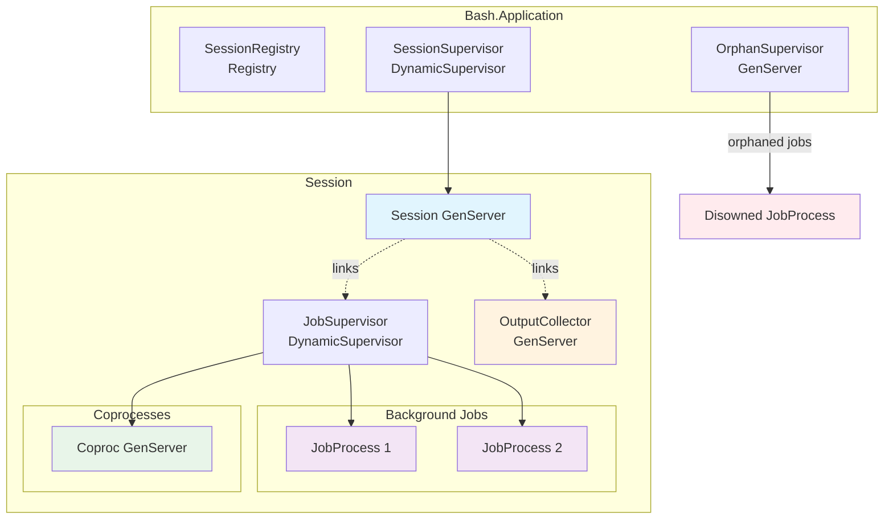

## GenServers

### Session GenServer

The central execution context managing all session state.

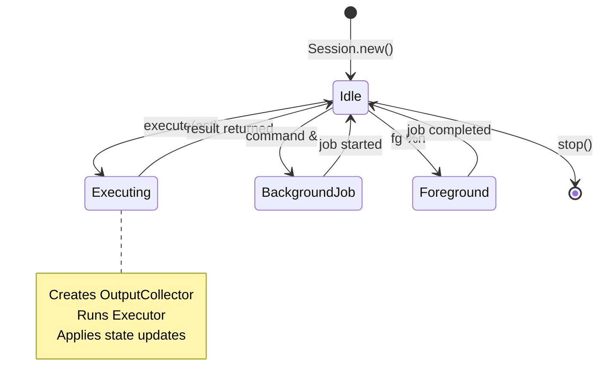

**State fields:**

| Field | Type | Purpose |
|-------|------|---------|
| `id` | String | Unique session identifier |
| `working_dir` | String | Current directory (PWD) |
| `variables` | Map | Environment variables as `Variable.t()` |
| `functions` | Map | Defined bash functions |
| `aliases` | Map | Command aliases |
| `jobs` | Map | Active background jobs |
| `job_supervisor` | pid | DynamicSupervisor for jobs |
| `output_collector` | pid | Current OutputCollector |
| `stdout_sink` / `stderr_sink` | function | Output destination functions |
| `executions` | list | Per-command execution records |
| `current` | Execution.t | Active execution context |
| `special_vars` | Map | `$?`, `$!`, `$$`, `$0`, `$_` |
| `positional_params` | list | Function argument stack |
| `file_descriptors` | Map | FD number to pid or `{:coproc, pid, :read \| :write}` |

**Internal fields (opaque):**
- `job_supervisor`, `output_collector` - Process pids
- `stdout_sink`, `stderr_sink` - Sink functions
- `executions`, `current`, `is_pipeline_tail` - Execution tracking
- `file_descriptors` - Routes FD reads/writes to coproc GenServers or StringIO devices

### OutputCollector GenServer

Accumulates interleaved stdout/stderr output with async writes.

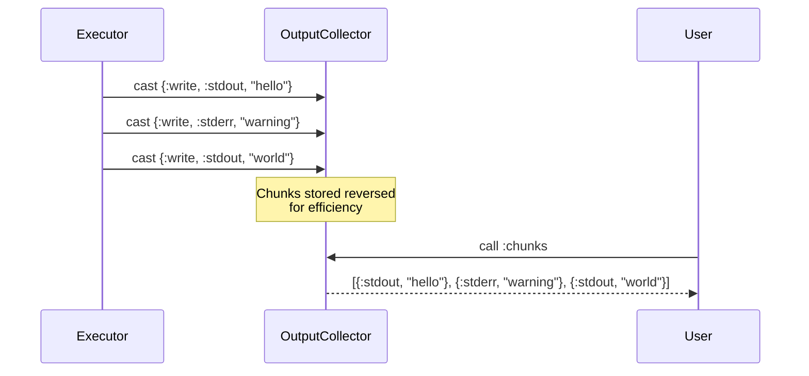

**Operations:**
- `write/3` - Async cast (non-blocking)
- `chunks/1` - Get interleaved output in order
- `stdout/1`, `stderr/1` - Get filtered streams
- `flush/1` - Get and clear

### JobProcess GenServer

Manages a single background OS process lifecycle.

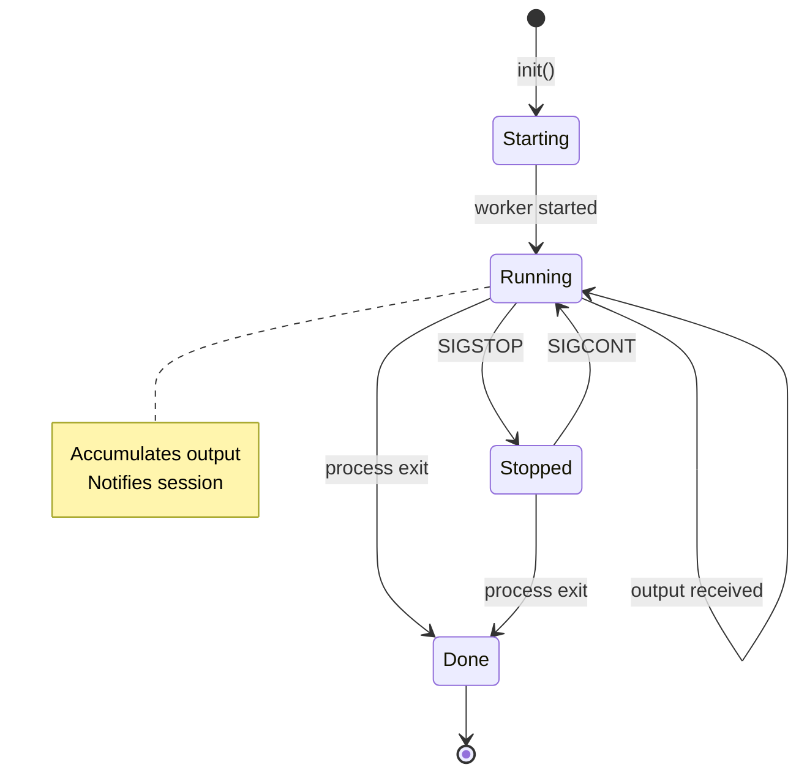

**Process model:**
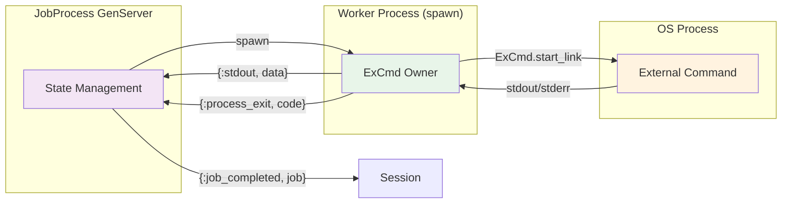

### Coproc GenServer

Manages a coprocess — a command running asynchronously with its stdin/stdout connected to the session via file descriptors. Operates in two modes:

- **External** — simple commands (e.g., `coproc cat`) backed by `ExCmd.Process`
- **Internal** — compound commands (e.g., `coproc NAME { cat; }`) backed by spawned BEAM processes with `Bash.Pipe` FIFOs

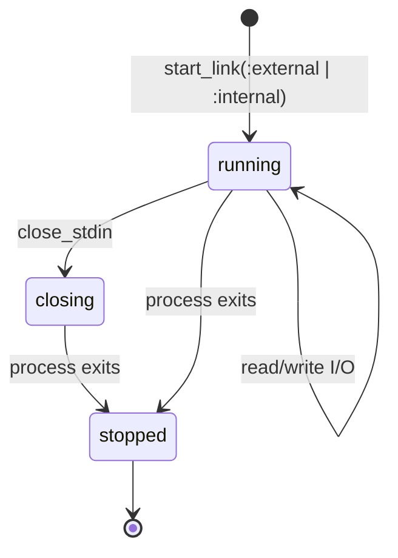

The session registers coproc file descriptors in `file_descriptors` as `{:coproc, pid, :read | :write}` tuples. Reads and writes on those FDs are routed through this GenServer. On session termination, all coproc FDs are closed and the coproc processes are stopped.

**Operations:**
- `read_output/2` - Read from coproc stdout
- `write_input/3` - Write to coproc stdin
- `close_read/2`, `close_write/2` - Close pipe ends
- `get_status/2` - Query coproc state

### ProcessSubst GenServer

Manages process substitution (`<(command)` and `>(command)`). Creates a named pipe (FIFO) and runs a background command connected to it. The FIFO path is substituted into the parent command as a filename.

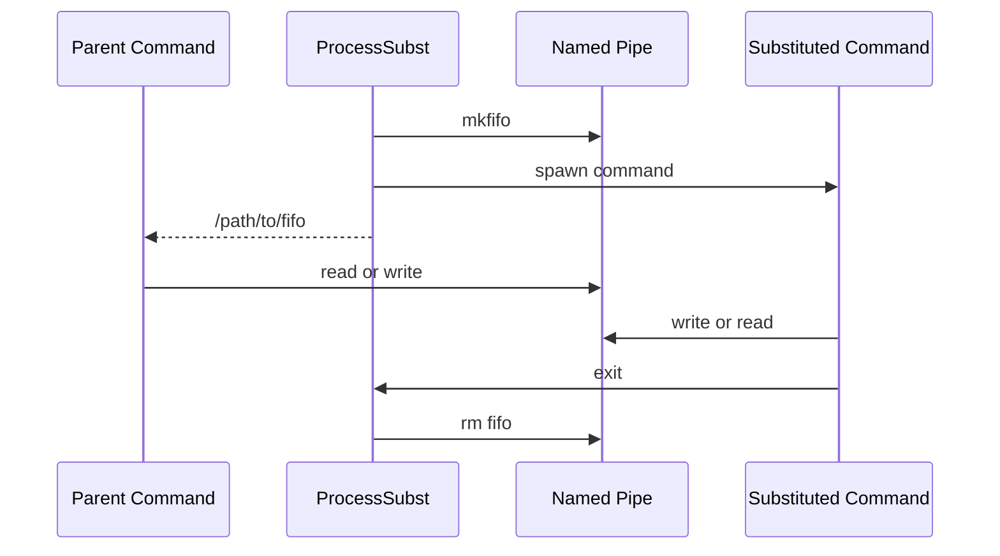

**State fields:**

| Field | Type | Purpose |
|-------|------|---------|
| `fifo_path` | String | Path to the named pipe |
| `direction` | `:input \| :output` | Whether parent reads or writes the FIFO |
| `command_ast` | term | AST of the substituted command |
| `session_state` | map | Snapshot of session state for execution |
| `worker_pid` | pid | Spawned process running the command |
| `os_pid` | integer | OS pid when using external commands |

## Output Flow

### Sink System

Sinks are functions that receive output chunks and route them to destinations.

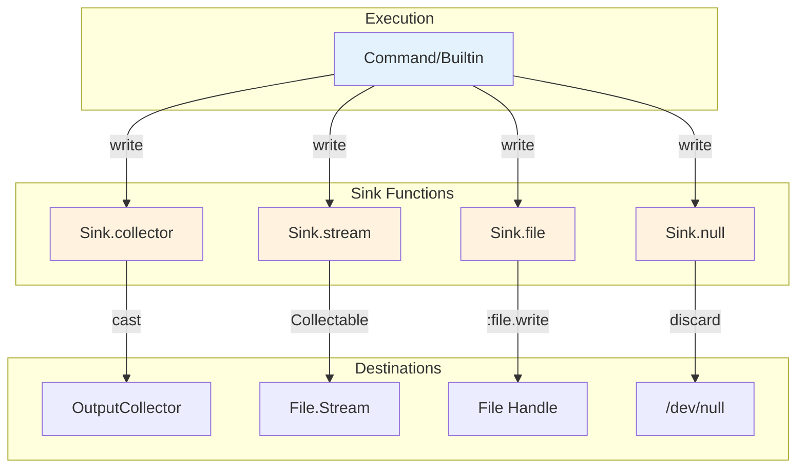

### Command Execution Output Flow

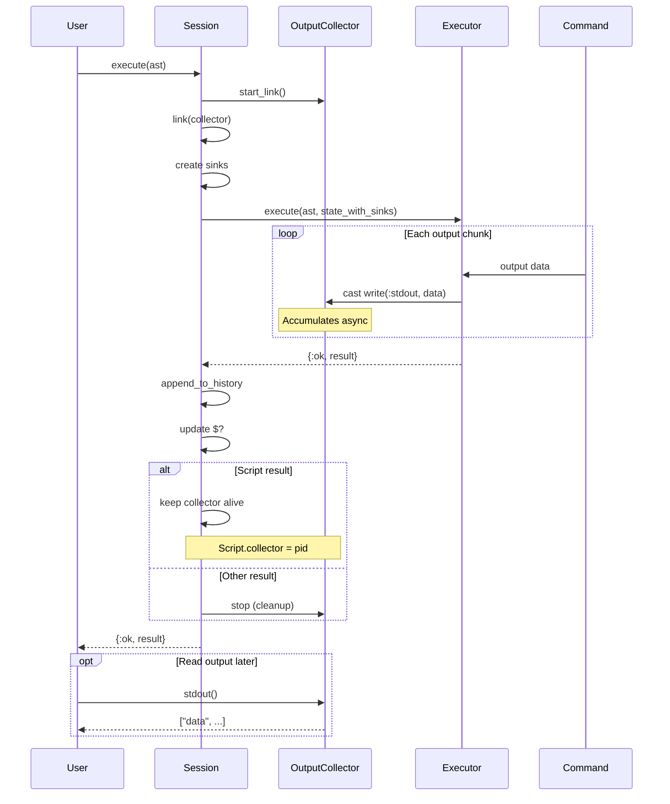

### Pipeline Output Flow

Intermediate commands write to StringIO for piping; the final command writes to sinks.

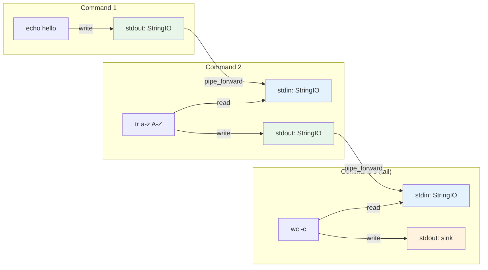

## Background Job Lifecycle

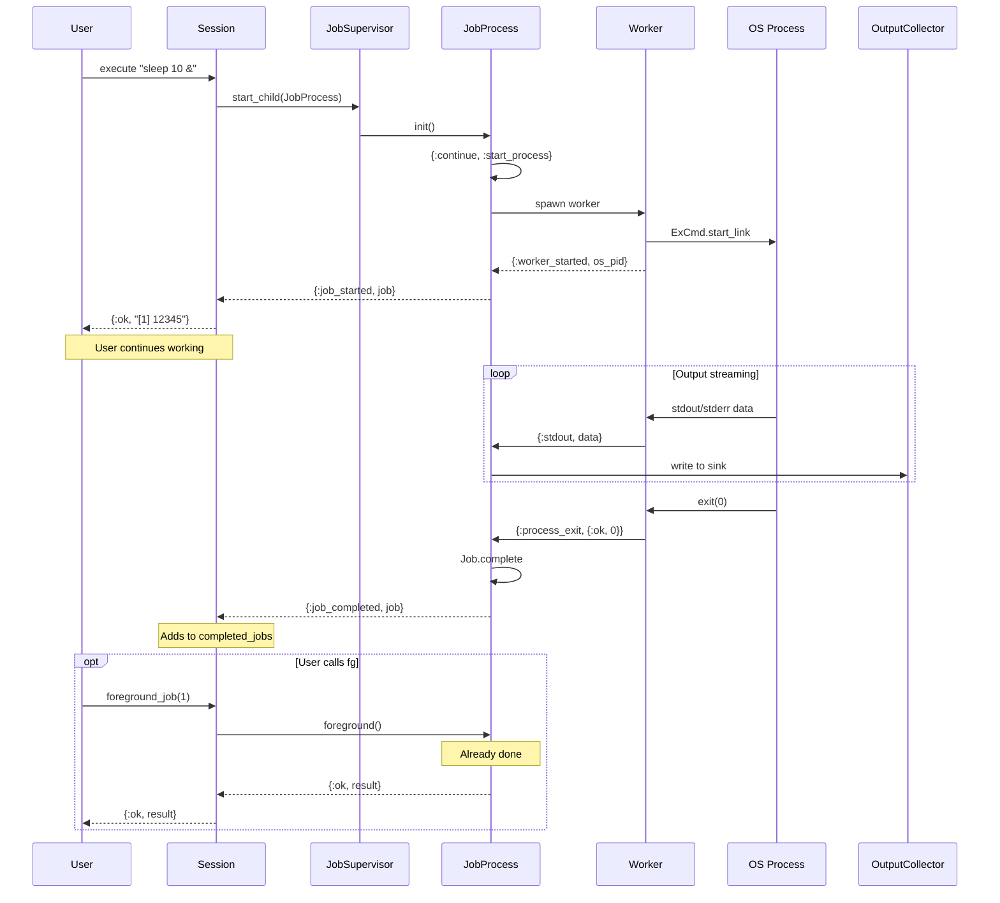

## Process Linking and Fault Tolerance

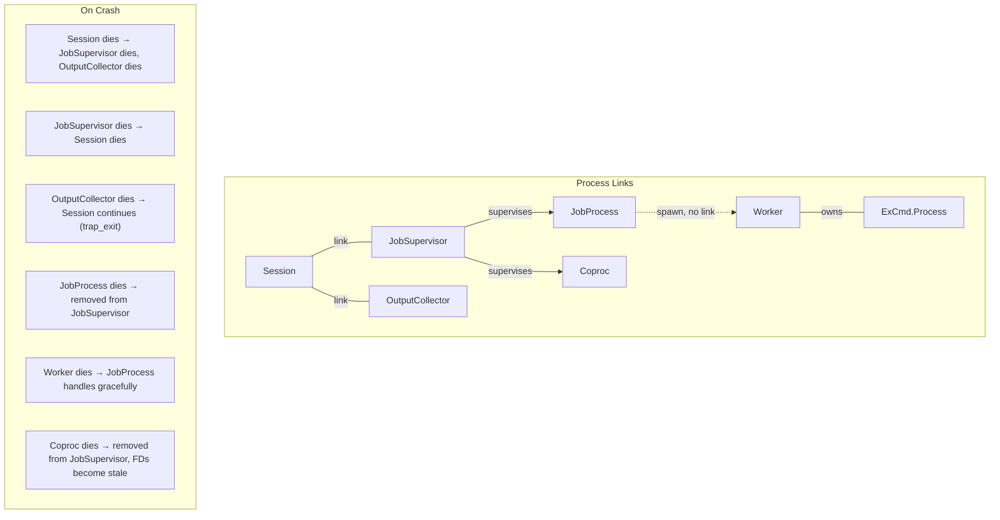

## Key Data Structures

### Execution

Per-command I/O context with StringIO devices:

```elixir
%Execution{
  command: "echo hello",
  stdout: #PID<0.123.0>,     # StringIO device
  stderr: #PID<0.124.0>,     # StringIO device
  exit_code: 0,
  started_at: ~U[2024-01-01 12:00:00Z],
  completed_at: ~U[2024-01-01 12:00:01Z]
}
```

### Job

Background job state (output flows to OutputCollector via sinks):

```elixir
%Job{
  job_number: 1,
  os_pid: 12345,
  erlang_pid: #PID<0.200.0>,  # JobProcess GenServer
  command: "sleep 100",
  status: :running,           # :running | :stopped | :done
  exit_code: nil
}
```

### Script (with collector reference)

```elixir
%Script{
  statements: [...],
  exit_code: 0,
  state_updates: %{},
  collector: #PID<0.150.0>   # OutputCollector for post-exec reading
}
```

## Design Patterns

### Async Output Collection

OutputCollector uses `GenServer.cast` for writes, preventing output buffering from blocking execution:

```elixir
# Non-blocking write
def write(pid, stream, data) do
  GenServer.cast(pid, {:write, stream, data})
end
```

### Worker Process Isolation

JobProcess spawns a separate worker to own ExCmd, keeping the GenServer responsive:

```elixir
# JobProcess stays responsive
spawn(fn ->
  {:ok, process} = ExCmd.Process.start_link(cmd, args)
  send(parent, {:worker_started, ExCmd.Process.os_pid(process)})
  read_output_loop(process, parent)
  exit_code = ExCmd.Process.await_exit(process)
  send(parent, {:process_exit, {:ok, exit_code}})
end)
```

### Pluggable Sinks

Output destinations are functions, enabling runtime routing:

```elixir
{:ok, session} = Bash.Session.new()

# Route stdout to file (pass Collectable directly, not a sink)
Bash.Session.execute(session, ast, stdout_into: File.stream!("/tmp/output.txt"))

# Real-time callback (receives {:stdout, data} or {:stderr, data} tuples)
Bash.Session.execute(session, ast, on_output: fn
  {:stdout, data} -> IO.write(data)
  {:stderr, data} -> IO.write(:stderr, data)
end)
```

### Variable Scoping Stack

Positional parameters use a stack for function call isolation:

```elixir
# Before function call
positional_params: [["arg1", "arg2"]]

# During function call (pushed)
positional_params: [["func_arg1"], ["arg1", "arg2"]]

# After function return (popped)
positional_params: [["arg1", "arg2"]]
```
